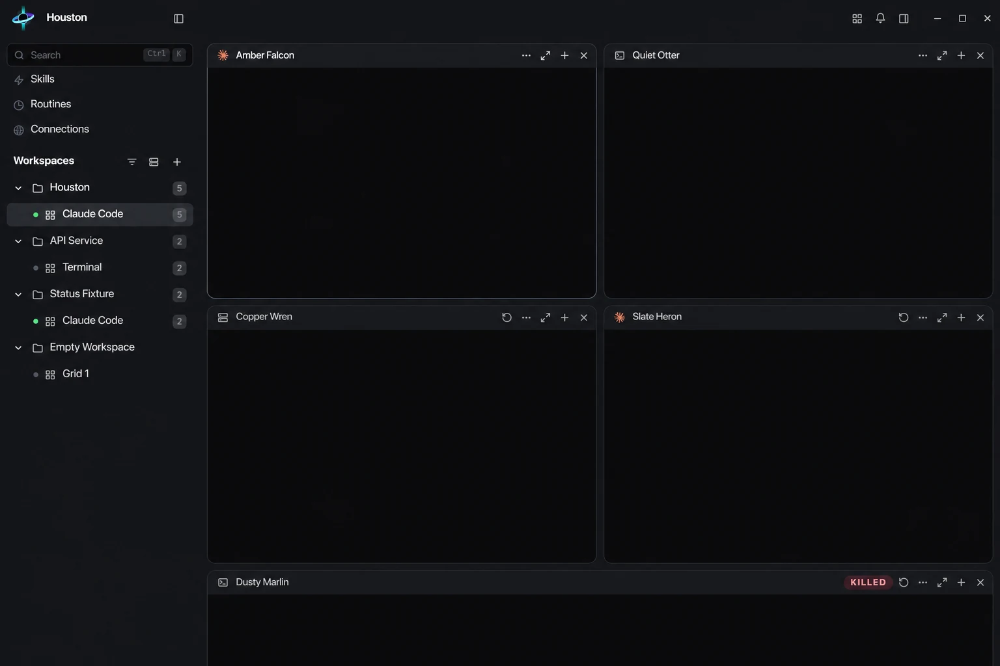

# Houston

**Local-first mission control for CLI coding agents.**

Houston runs agent CLIs in a persistent grid of real terminals. Sessions continue in a
detached daemon when the window closes, and agents can open and coordinate additional panes
through Houston's local orchestration tools.

[Download Houston](https://github.com/theogmiguel/houston/releases) ·
[Documentation](docs/README.md) · [Contributing](CONTRIBUTING.md)

## Why Houston

- **Persistent sessions.** Closing the desktop app detaches from the daemon without stopping
  running agents or shells.
- **Real terminals.** Every pane is a PTY rendered by Houston's terminal engine. Input goes
  directly to the hosted CLI; terminal output is not treated as a chat transcript.
- **Agent orchestration.** An agent can create, message and wait for other panes through a
  local MCP interface, while every pane remains available for direct interaction.
- **Independent routines.** Scheduled and on-demand routines start fresh agent panes with
  their own model, effort, permissions and working directory.
- **Workspace tools.** Source changes, files, an editor, browser panes, SSH connections,
  reusable skills and provider profiles live alongside the terminal grid.
- **Local control plane.** Houston has no account, hosted control plane or telemetry. Session
  state remains local, and secrets managed by Houston use the operating system keychain.

## Supported agent CLIs

Houston can start and manage these CLIs when their executable is available on `PATH`:

| Provider | Executable |
|---|---|
| Claude Code | `claude` |
| Codex | `codex` |
| Antigravity | `agy` |
| OpenCode | `opencode` |
| Cursor | `cursor-agent` |
| Grok | `grok` |

Droid, Copilot and Aider are recognised when launched manually in a shell pane, but Houston
does not start or configure them. Provider installation and authentication remain the
provider's responsibility; see the [installation guide](docs/user/install.md).

## Install

Download the current release from [GitHub Releases](https://github.com/theogmiguel/houston/releases).

| Platform | Official artifacts | Support baseline |
|---|---|---|
| Linux x86_64 | AppImage, `.deb` | glibc 2.35 or newer |
| Linux ARM64 | AppImage, `.deb` | glibc 2.35 or newer |
| Windows x86_64 | NSIS `.exe` | Windows 10 or 11 |

Linux is the lead platform. macOS is not currently supported. Alpine, NixOS, BSD and other
non-glibc environments do not receive official packages; community or source builds are
best effort.

The Windows installer is not Authenticode-signed, so SmartScreen may warn on first launch.
Release artifacts are signed for Houston's updater and verified before installation.

For source builds, prerequisites and platform-specific commands, follow
[`docs/operations/development.md`](docs/operations/development.md).

## How it works

The desktop app opens one authenticated WebSocket to `houston-core`, a detached Rust daemon.
The daemon owns PTYs, session state, provider hooks and the local orchestration endpoint.
Control messages and binary terminal frames share the same connection. Closing the window
removes the client; it does not terminate the daemon or its sessions.

The architecture is documented in [`docs/internals/overview.md`](docs/internals/overview.md).

## Privacy and updates

Local-first does not mean offline. Agent CLIs, Git and GitHub operations, browser and MCP
integrations, model downloads and optional cloud dictation use their respective network
services when invoked. Houston has no hosted account or telemetry service. Its background
update check queries GitHub, can be disabled, and never installs without an explicit click.

## Documentation

- [Install Houston and configure providers](docs/user/install.md)
- [Work with panes, grids and workspaces](docs/user/panes-and-grids.md)
- [Coordinate agents from other panes](docs/user/orchestration.md)
- [Create scheduled and on-demand routines](docs/user/routines.md)
- [Update an installed release](docs/user/updating.md)
- [Browse the complete documentation index](docs/README.md)

## Contributing

Contributions are welcome. Read [`CONTRIBUTING.md`](CONTRIBUTING.md) before opening an issue or
pull request. Feature proposals belong in the
[Ideas discussion](https://github.com/theogmiguel/houston/discussions/categories/ideas).

## License

Houston is licensed under Apache-2.0. See [`LICENSE`](LICENSE) and [`NOTICE`](NOTICE).
The licence does not grant rights to the Houston name or marks.
